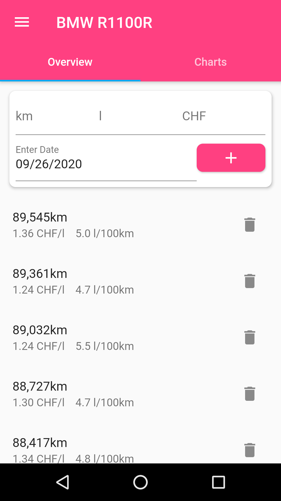
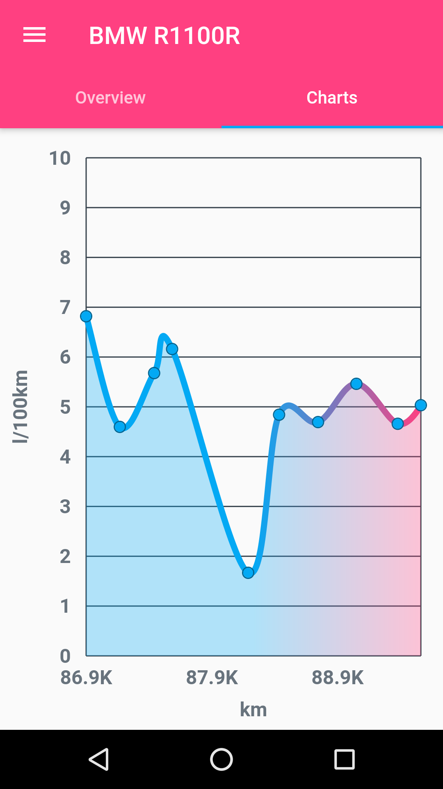

# Consumption Tracker

Track the gas consumption of your vehicle.

## Screenshots (preview version)
|  |  | 
| --- | --- |

## Available platforms

## Develop

If you want to develop the app yourself you need to do the following:

* [Install flutter](https://flutter.dev/docs/get-started/install).
* Install [AndroidStudio](https://developer.android.com/studio/install)
  or [VSCode](https://code.visualstudio.com/docs/setup/setup-overview) 
  and the respective [dart and flutter plugins](https://flutter.dev/docs/get-started/editor).
* Import the project from github and get going!
* More resources on [flutter development](https://flutter.dev).

## Acknowledgements
* This project is developed using google's [flutter](https://flutter.dev/) framework.
* The app icon is provided by [Icons8](https://icons8.com/icons/set/odometer).
